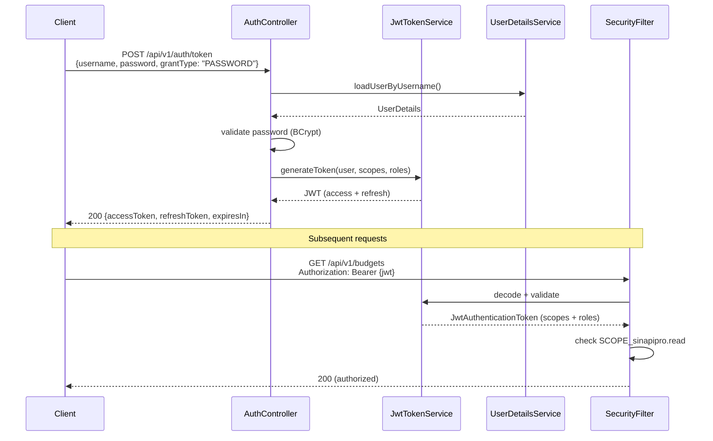
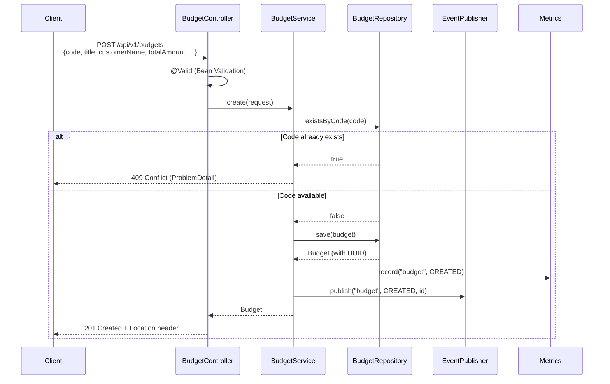
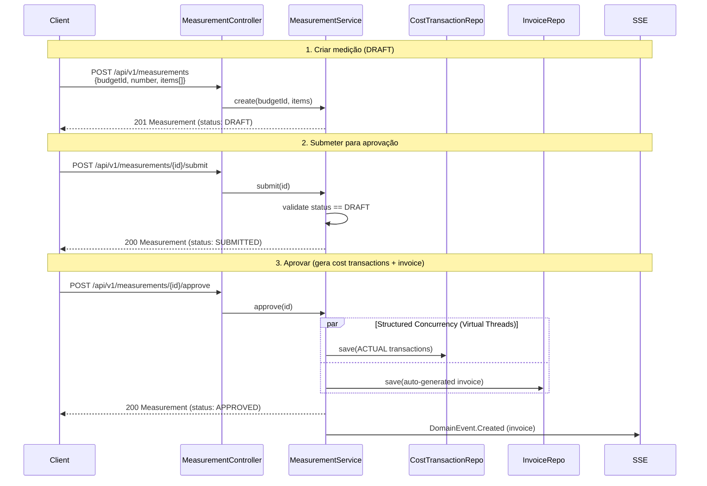
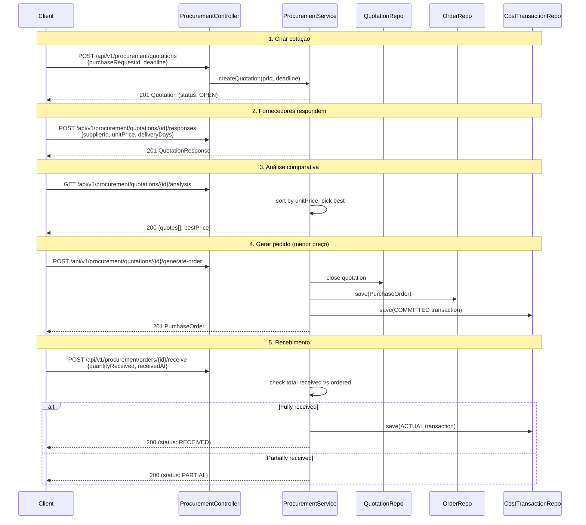
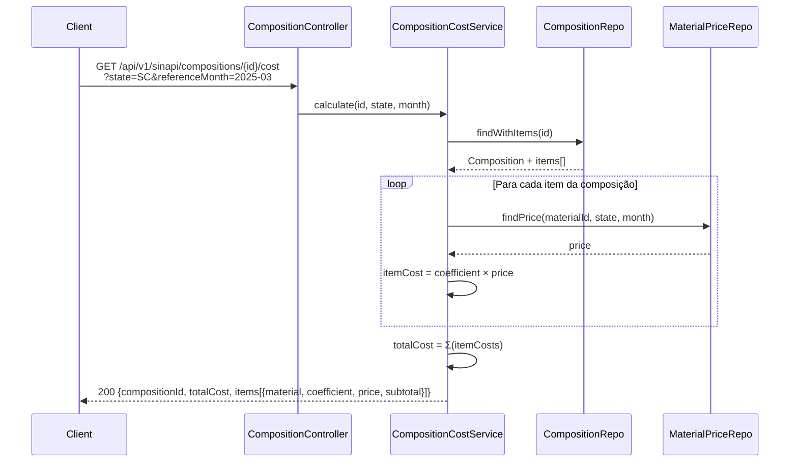
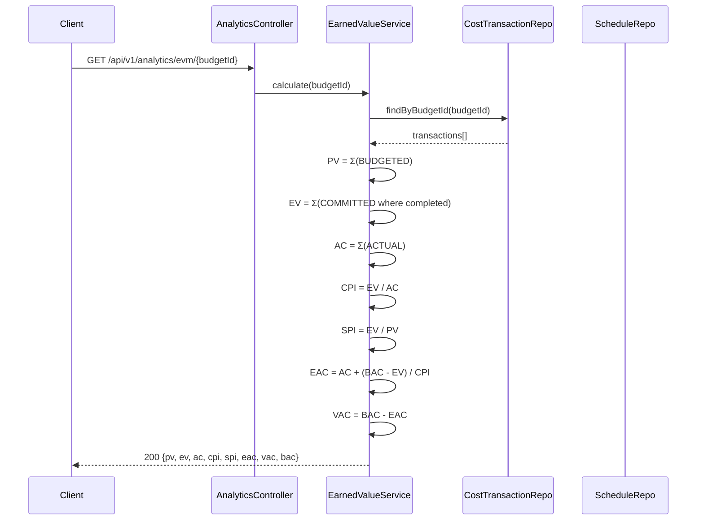
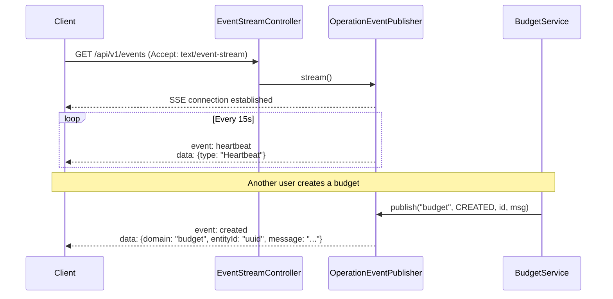

# 🔄 Fluxos da API — Diagramas de Sequência

## Autenticação (JWT)

## Criação de Orçamento (Budget)

## Fluxo de Medição (Workflow Completo)

## Fluxo de Suprimentos (Cotação → Pedido → Recebimento)

## Cálculo de Custo SINAPI

## EVM (Earned Value Management)

## Server-Sent Events (Notificações Real-time)

