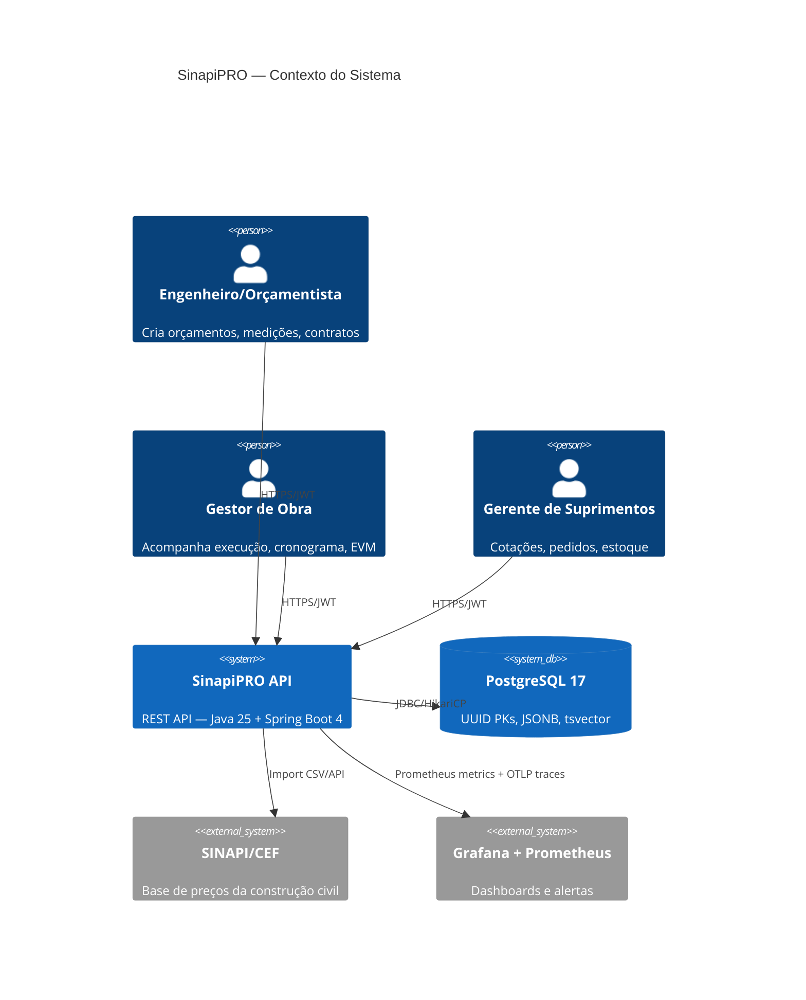
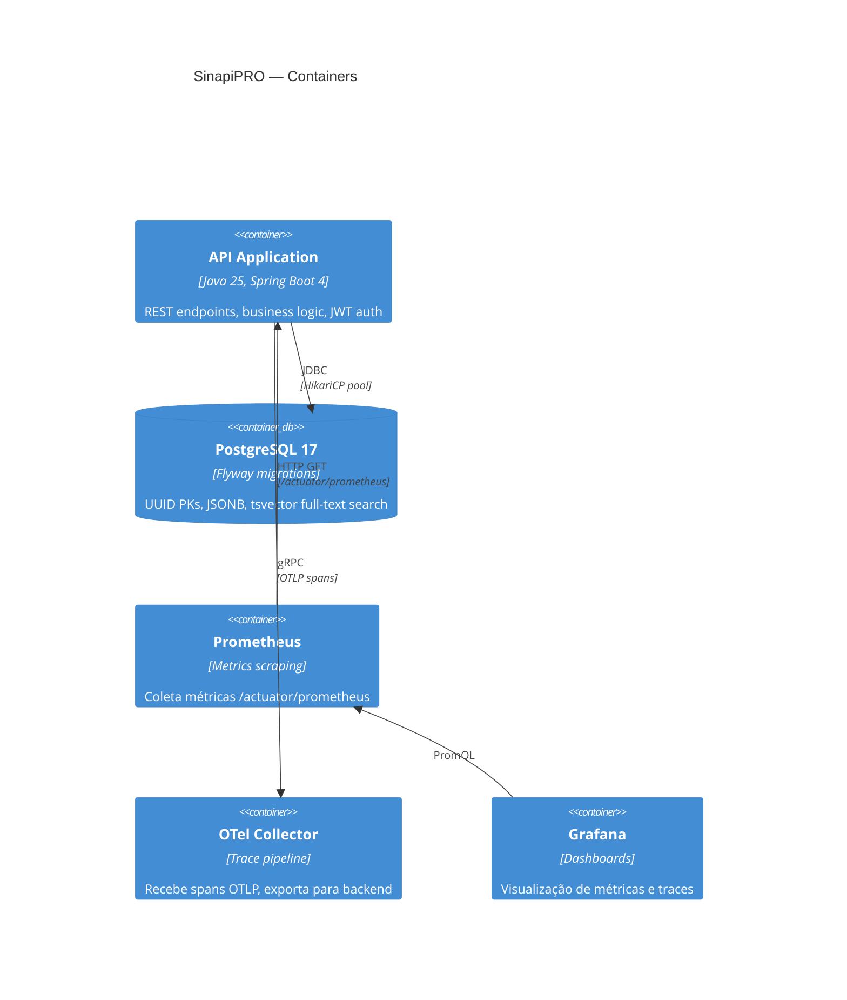
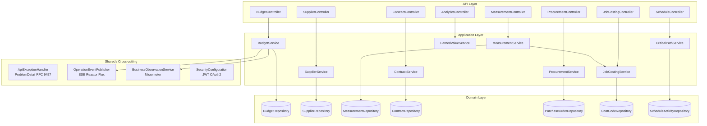

# 🏗️ Arquitetura — SinapiPRO

## Visão Geral (C4 — Context)



## Arquitetura de Componentes (C4 — Container)



## Módulos Internos (Vertical Slicing)



## Padrão por Módulo

```
{module}/
├── api/            ← @RestController + request/response records
├── application/    ← @Service + @Transactional + business logic
└── domain/         ← @Entity + Repository interface (Spring Data)
```

**Regras:**
- `api/` — sem lógica de negócio, apenas validação de entrada e mapeamento
- `application/` — orquestra domínio, eventos, métricas. Ponto de transação
- `domain/` — entities JPA + repository. Sem dependência de outros módulos
- `shared/` — cross-cutting: base entity, error handler, events, observability

## Features Java 25 na Arquitetura

| Feature | Uso Arquitetural |
|---------|-----------------|
| Virtual Threads | Todas as requests HTTP (zero thread pinning) |
| Structured Concurrency | Operações paralelas em services (approve + invoice) |
| Sealed Classes | Hierarquia de exceções (`DomainException`), domain events (`DomainEvent`) |
| Gatherers | Agregações em stream (Curva ABC, WIP Report, Measurement Summary) |
| Pattern Matching | Exception handler exhaustivo, validações de status |
| Records | DTOs, value objects, resultados de cálculo |
| Module Imports | `import module java.base` em todos os services |

## Decisões Arquiteturais

| Decisão | Justificativa |
|---------|---------------|
| Monolito modular | Complexidade de domínio, não de escala. Vertical slicing isola módulos |
| UUID como PK | Distributed-friendly, sem exposição de sequência, geração client-side |
| JSONB para metadata | Flexibilidade sem migrations para campos opcionais |
| tsvector full-text | Busca em composições/materiais SINAPI sem Elasticsearch |
| Stateless (JWT) | Escalabilidade horizontal sem session affinity |
| SSE (não WebSocket) | Unidirecional server→client, compatível com HTTP/2, sem state |
| ProblemDetail (RFC 9457) | Padrão de erro interoperável, extensível |
