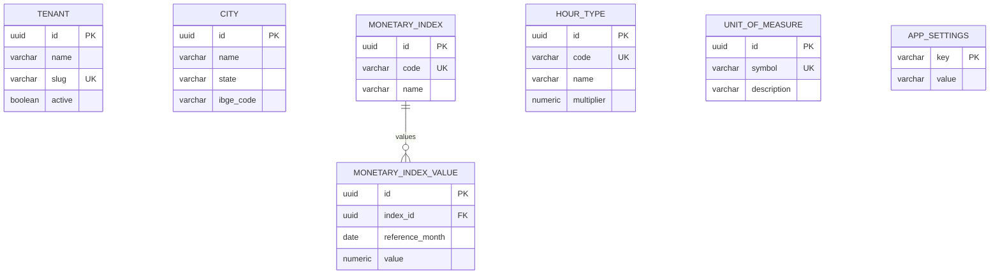
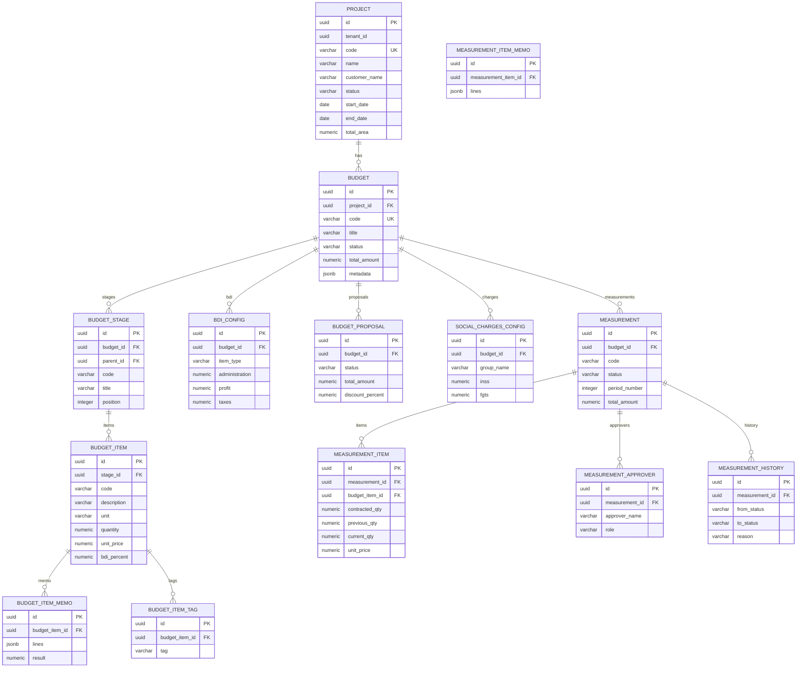
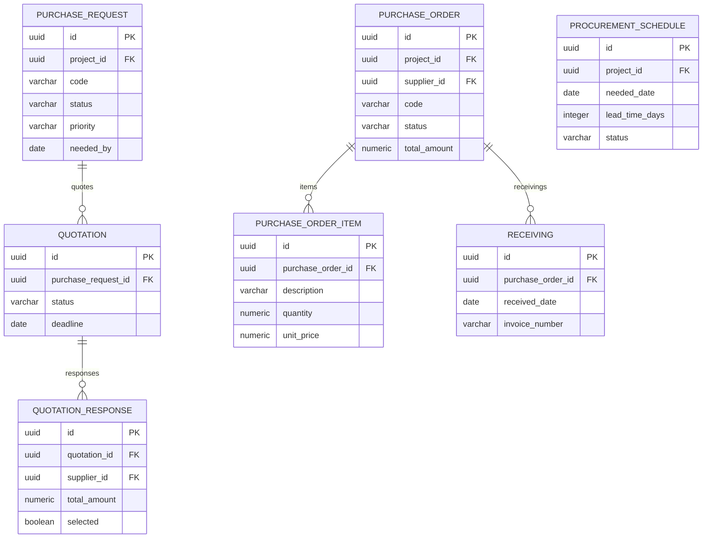
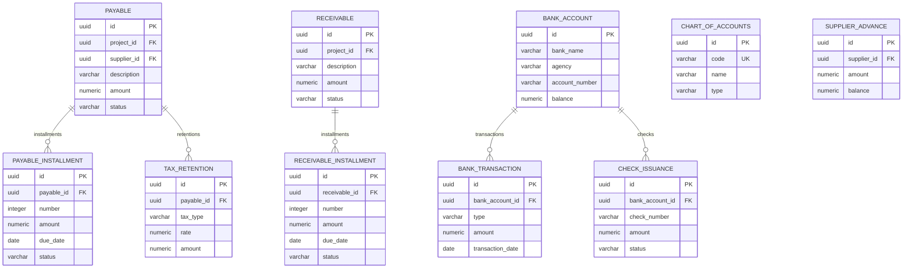
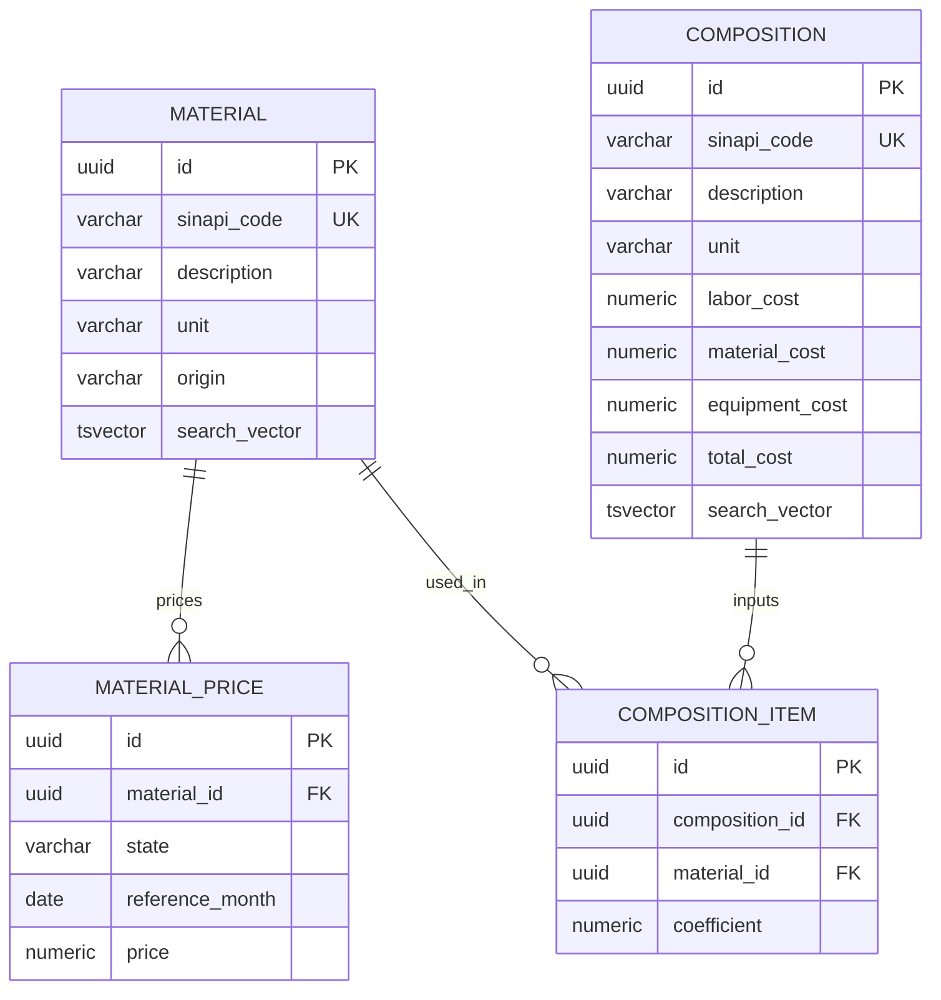

# 🗄️ Modelo de Dados — PostgreSQL 17

> ~85 tabelas | UUID PKs | JSONB metadata | tsvector full-text | Flyway V1–V4

## Convenções

- **Primary Key**: `id uuid DEFAULT gen_random_uuid()`
- **Auditoria**: `created_at timestamptz`, `updated_at timestamptz`
- **Multi-tenant**: `tenant_id uuid` nas tabelas de dados por empresa
- **Soft delete**: via módulo `shared.TrashItem` (lixeira com restore)
- **Monetário**: `numeric(18,2)` para valores, `numeric(6,4)` para percentuais

---

## Tabelas Globais (sem tenant)

---

## Core: Projeto + Orçamento + Medição

---

## Contratos + Job Costing

```mermaid
erDiagram
    CONTRACT {
        uuid id PK
        uuid project_id FK
        uuid supplier_id FK
        varchar code
        varchar title
        varchar type
        varchar status
        numeric total_amount
        numeric retention_percent
    }
    CHANGE_ORDER {
        uuid id PK
        uuid contract_id FK
        varchar code
        numeric amount
        varchar status
    }
    COST_CODE {
        uuid id PK
        uuid project_id FK
        varchar code
        varchar description
        numeric budget_amount
    }
    COST_TRANSACTION {
        uuid id PK
        uuid cost_code_id FK
        varchar type
        numeric amount
        date reference_date
        varchar source_type
    }

    CONTRACT ||--o{ CHANGE_ORDER : "addendums"
    COST_CODE ||--o{ COST_TRANSACTION : "transactions"
```

---

## Suprimentos + Estoque

---

## Financeiro

---

## Comercial (Vendas Imobiliárias)

| Tabela | Descrição |
|--------|-----------|
| `development` | Empreendimentos imobiliários |
| `development_unit` | Unidades (apartamentos, lotes) |
| `sale_contract` | Contratos de venda |
| `sale_installment` | Parcelas do contrato |
| `service_ticket` | Tickets de pós-venda |

---

## Cronograma + Diário + Equipamentos

| Tabela | Descrição |
|--------|-----------|
| `schedule_activity` | Atividades do cronograma (CPM, WBS) |
| `activity_dependency` | Dependências FS/FF/SS/SF com lag |
| `schedule_baseline` | Snapshots do cronograma (JSONB) |
| `schedule_holiday` | Feriados por obra |
| `daily_log` | Diário de obra (cabeçalho) |
| `daily_log_task/labor/equipment/material/occurrence/photo` | Detalhes do diário |
| `equipment` | Cadastro de equipamentos |
| `equipment_usage` | Horas de uso |
| `equipment_fueling` | Abastecimentos |
| `weather_delay` | Atrasos por clima |

---

## Segurança + Qualidade + Documentos

| Tabela | Descrição |
|--------|-----------|
| `safety_inspection` | Inspeções de segurança |
| `safety_incident` | Incidentes/acidentes |
| `rfi` | Request for Information |
| `punch_list_item` | Pendências de entrega |
| `submittal` | Aprovação de materiais/métodos |
| `document` | Documentos vinculados a obras |
| `document_version` | Versionamento de documentos |

---

## SINAPI (Composições + Insumos)

---

## Cadastros (Registry)

| Tabela | Descrição |
|--------|-----------|
| `client` | Clientes (PF/PJ) |
| `employee` | Funcionários |
| `supplier` | Fornecedores |
| `supplier_document/bank_account/evaluation` | Extensões do fornecedor |
| `bank_account` | Contas bancárias da empresa |
| `team` / `team_member` | Equipes de obra |

---

## Plataforma

| Tabela | Descrição |
|--------|-----------|
| `tenant` | Empresas (multi-tenant) |
| `notification` | Notificações do sistema |
| `report_template` | Templates de relatório |
| `trash_item` | Lixeira (soft delete com restore) |

---

## Índices (V4)

- `tsvector` GIN indexes em `material.search_vector` e `composition.search_vector`
- Suportam busca full-text em português para composições SINAPI
