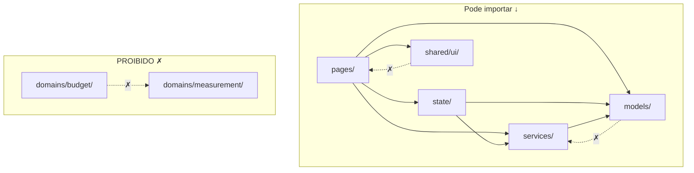
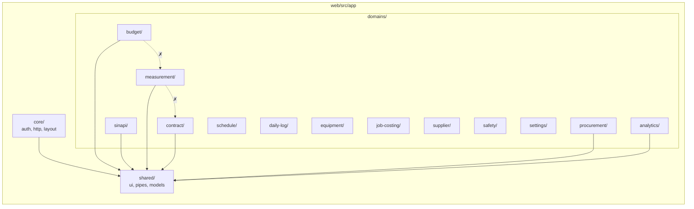

# 🅰️ Frontend Angular 19 — Arquitetura

## Metodologia: Feature-Shell + Clean Architecture

Baseado em:
- [Nx Enterprise Patterns](https://nx.dev/concepts/more-concepts/applications-and-libraries)
- [Angular Architecture Guide (Manfred Steyer)](https://www.angulararchitects.io/en/blog/angular-architecture-guide/)
- [Clean Architecture (Uncle Bob)](https://blog.cleancoder.com/uncle-bob/2012/08/13/the-clean-architecture.html)

### Princípios

1. **Separação por domínio** — cada domínio de negócio é isolado
2. **Camadas com direção de dependência** — UI → Application → Domain (nunca o inverso)
3. **Shared explícito** — código compartilhado em libs com contratos claros
4. **Lazy by default** — cada domínio carrega sob demanda
5. **Barrel exports** — cada lib expõe apenas o que é público via `index.ts`

---

## Estrutura de Diretórios

```
web/
├── src/
│   ├── app/
│   │   ├── app.component.ts
│   │   ├── app.config.ts
│   │   ├── app.routes.ts
│   │   │
│   │   ├── core/                         ← SINGLETON (1 instância, nunca importado por features)
│   │   │   ├── auth/
│   │   │   │   ├── services/
│   │   │   │   │   └── auth.service.ts
│   │   │   │   ├── interceptors/
│   │   │   │   │   └── jwt.interceptor.ts
│   │   │   │   ├── guards/
│   │   │   │   │   └── auth.guard.ts
│   │   │   │   └── index.ts
│   │   │   ├── http/
│   │   │   │   ├── api-client.ts          ← Base URL, error handling global
│   │   │   │   └── index.ts
│   │   │   ├── layout/
│   │   │   │   ├── shell/
│   │   │   │   │   └── shell.component.ts ← Sidebar + topbar + router-outlet
│   │   │   │   ├── sidebar/
│   │   │   │   └── topbar/
│   │   │   └── core.providers.ts          ← provideCore() — registra tudo
│   │   │
│   │   ├── shared/                        ← REUTILIZÁVEL (importado por qualquer feature)
│   │   │   ├── ui/                        ← Componentes visuais genéricos
│   │   │   │   ├── data-table/
│   │   │   │   ├── page-header/
│   │   │   │   ├── confirm-dialog/
│   │   │   │   ├── status-badge/
│   │   │   │   ├── empty-state/
│   │   │   │   ├── kpi-card/
│   │   │   │   ├── currency-input/
│   │   │   │   └── index.ts
│   │   │   ├── pipes/
│   │   │   │   ├── currency-brl.pipe.ts
│   │   │   │   ├── date-br.pipe.ts
│   │   │   │   └── index.ts
│   │   │   ├── directives/
│   │   │   │   ├── permission.directive.ts
│   │   │   │   └── index.ts
│   │   │   ├── models/                    ← Interfaces/types compartilhados
│   │   │   │   ├── page-response.model.ts
│   │   │   │   ├── problem-detail.model.ts
│   │   │   │   └── index.ts
│   │   │   └── utils/
│   │   │       ├── form.utils.ts
│   │   │       └── index.ts
│   │   │
│   │   └── domains/                       ← FEATURES POR DOMÍNIO DE NEGÓCIO
│   │       │
│   │       ├── budget/                    ← Domínio: Orçamentos
│   │       │   ├── routes.ts              ← Lazy routes deste domínio
│   │       │   ├── models/
│   │       │   │   ├── budget.model.ts
│   │       │   │   ├── budget-stage.model.ts
│   │       │   │   └── bdi-config.model.ts
│   │       │   ├── services/
│   │       │   │   └── budget.api.ts      ← HTTP calls (httpResource)
│   │       │   ├── state/
│   │       │   │   └── budget.store.ts    ← Signal store
│   │       │   └── pages/                 ← Smart components (routed)
│   │       │       ├── budget-list/
│   │       │       │   ├── budget-list.page.ts
│   │       │       │   └── budget-list.page.html
│   │       │       ├── budget-form/
│   │       │       │   ├── budget-form.page.ts
│   │       │       │   └── budget-form.page.html
│   │       │       └── budget-detail/
│   │       │           ├── budget-detail.page.ts
│   │       │           ├── budget-detail.page.html
│   │       │           └── components/    ← Dumb components (só deste domínio)
│   │       │               ├── stage-tree.component.ts
│   │       │               ├── item-table.component.ts
│   │       │               └── bdi-form.component.ts
│   │       │
│   │       ├── sinapi/                    ← Domínio: Catálogo SINAPI
│   │       │   ├── routes.ts
│   │       │   ├── models/
│   │       │   ├── services/
│   │       │   ├── state/
│   │       │   └── pages/
│   │       │       ├── composition-list/
│   │       │       ├── composition-detail/
│   │       │       ├── material-list/
│   │       │       └── material-prices/
│   │       │
│   │       ├── measurement/               ← Domínio: Medições
│   │       │   ├── routes.ts
│   │       │   ├── models/
│   │       │   ├── services/
│   │       │   ├── state/
│   │       │   └── pages/
│   │       │       ├── measurement-list/
│   │       │       ├── measurement-form/
│   │       │       └── measurement-workflow/  ← Stepper DRAFT→APPROVED
│   │       │
│   │       ├── contract/                  ← Domínio: Contratos
│   │       │   └── ...
│   │       │
│   │       ├── procurement/               ← Domínio: Suprimentos
│   │       │   ├── routes.ts
│   │       │   ├── models/
│   │       │   ├── services/
│   │       │   ├── state/
│   │       │   └── pages/
│   │       │       ├── quotation-list/
│   │       │       ├── quotation-analysis/
│   │       │       ├── order-list/
│   │       │       ├── order-receiving/
│   │       │       └── inventory/
│   │       │
│   │       ├── schedule/                  ← Domínio: Cronograma
│   │       │   └── pages/
│   │       │       ├── gantt/
│   │       │       └── s-curve/
│   │       │
│   │       ├── daily-log/                 ← Domínio: Diário de Obra
│   │       │   └── ...
│   │       │
│   │       ├── equipment/                 ← Domínio: Equipamentos
│   │       │   └── ...
│   │       │
│   │       ├── job-costing/               ← Domínio: Job Costing / EVM
│   │       │   └── pages/
│   │       │       ├── cost-dashboard/
│   │       │       └── wip-report/
│   │       │
│   │       ├── analytics/                 ← Domínio: Relatórios e Dashboards
│   │       │   └── pages/
│   │       │       ├── evm-dashboard/
│   │       │       ├── cash-flow/
│   │       │       ├── abc-curve/
│   │       │       └── portfolio/
│   │       │
│   │       ├── supplier/                  ← Domínio: Fornecedores
│   │       │   └── ...
│   │       │
│   │       ├── safety/                    ← Domínio: Segurança do Trabalho
│   │       │   └── ...
│   │       │
│   │       └── settings/                  ← Domínio: Configurações
│   │           └── pages/
│   │               ├── users/
│   │               ├── company/
│   │               └── auxiliary-tables/   ← CRUD genérico para tabelas auxiliares
│   │
│   ├── environments/
│   │   ├── environment.ts
│   │   └── environment.prod.ts
│   │
│   ├── styles/
│   │   ├── _variables.scss
│   │   ├── _theme.scss                    ← Angular Material custom theme
│   │   └── styles.scss
│   │
│   └── index.html
│
├── angular.json
├── package.json
└── tsconfig.json
```

---

## Regras de Dependência (Enforcement)



| Regra | Descrição |
|-------|-----------|
| **Domínios não se importam** | `budget/` nunca importa de `measurement/`. Se precisar compartilhar, vai para `shared/models/` |
| **`shared/` não importa de `domains/`** | Shared é genérico, não conhece negócio |
| **`core/` é singleton** | Importado apenas no `app.config.ts`, nunca por features |
| **Pages são smart, components são dumb** | Pages injetam stores/services. Components recebem `input()` e emitem `output()` |
| **1 store por domínio** | Cada domínio tem no máximo 1 signal store |

---

## Camadas dentro de cada Domínio

```
domains/{dominio}/
├── models/        ← DOMAIN LAYER: interfaces, types, enums (zero dependências)
├── services/      ← DATA LAYER: HTTP calls, mappers (depende de models)
├── state/         ← APPLICATION LAYER: signal store, lógica de orquestração
└── pages/         ← PRESENTATION LAYER: componentes Angular (depende de tudo acima)
    └── components/ ← Dumb components locais (só input/output)
```

Isso é **Clean Architecture** aplicada ao Angular:
- `models/` = Entities
- `services/` = Gateways/Repositories
- `state/` = Use Cases
- `pages/` = Presenters/Views

---

## Roteamento (Lazy Loading por Domínio)

```typescript
// app.routes.ts
export const routes: Routes = [
  { path: '', redirectTo: 'dashboard', pathMatch: 'full' },
  { path: 'login', loadComponent: () => import('./core/auth/login.page') },
  {
    path: '',
    component: ShellComponent,  // layout com sidebar
    canActivate: [authGuard],
    children: [
      { path: 'dashboard', loadComponent: () => import('./domains/analytics/pages/portfolio/portfolio.page') },
      { path: 'budgets', loadChildren: () => import('./domains/budget/routes') },
      { path: 'sinapi', loadChildren: () => import('./domains/sinapi/routes') },
      { path: 'measurements', loadChildren: () => import('./domains/measurement/routes') },
      { path: 'contracts', loadChildren: () => import('./domains/contract/routes') },
      { path: 'procurement', loadChildren: () => import('./domains/procurement/routes') },
      { path: 'schedule', loadChildren: () => import('./domains/schedule/routes') },
      { path: 'daily-log', loadChildren: () => import('./domains/daily-log/routes') },
      { path: 'equipment', loadChildren: () => import('./domains/equipment/routes') },
      { path: 'job-costing', loadChildren: () => import('./domains/job-costing/routes') },
      { path: 'analytics', loadChildren: () => import('./domains/analytics/routes') },
      { path: 'suppliers', loadChildren: () => import('./domains/supplier/routes') },
      { path: 'safety', loadChildren: () => import('./domains/safety/routes') },
      { path: 'settings', loadChildren: () => import('./domains/settings/routes') },
    ]
  }
];
```

---

## Exemplo: Signal Store (Budget)

```typescript
// domains/budget/state/budget.store.ts
import { signalStore, withState, withMethods, withComputed } from '@ngrx/signals';
import { inject } from '@angular/core';
import { BudgetApi } from '../services/budget.api';
import { Budget, BudgetStatus } from '../models/budget.model';

type BudgetState = {
  budgets: Budget[];
  loading: boolean;
  filter: { status?: BudgetStatus; customer?: string };
  selectedId: string | null;
};

export const BudgetStore = signalStore(
  { providedIn: 'root' },
  withState<BudgetState>({ budgets: [], loading: false, filter: {}, selectedId: null }),
  withComputed(({ budgets, selectedId }) => ({
    selected: computed(() => budgets().find(b => b.id === selectedId())),
    totalAmount: computed(() => budgets().reduce((sum, b) => sum + b.totalAmount, 0)),
  })),
  withMethods((store, api = inject(BudgetApi)) => ({
    async loadAll() {
      patchState(store, { loading: true });
      const page = await api.list(store.filter());
      patchState(store, { budgets: page.content, loading: false });
    },
    async create(request: CreateBudgetRequest) {
      const budget = await api.create(request);
      patchState(store, { budgets: [...store.budgets(), budget] });
    },
  }))
);
```

---

## Fases de Implementação

| Fase | Domínios | Semanas |
|------|----------|---------|
| **1 — Foundation** | `core/` + `shared/` + `budget/` + `sinapi/` + `supplier/` | 4 |
| **2 — Operacional** | `measurement/` + `contract/` + `procurement/` + `daily-log/` + `equipment/` | 3 |
| **3 — Analytics** | `job-costing/` + `schedule/` + `analytics/` | 2 |
| **4 — Settings** | `settings/` + `safety/` + tabelas auxiliares | 2 |

---

## Resumo da Arquitetura



Cada domínio é **autônomo**, **lazy-loaded**, e segue a mesma estrutura interna (`models → services → state → pages`).
