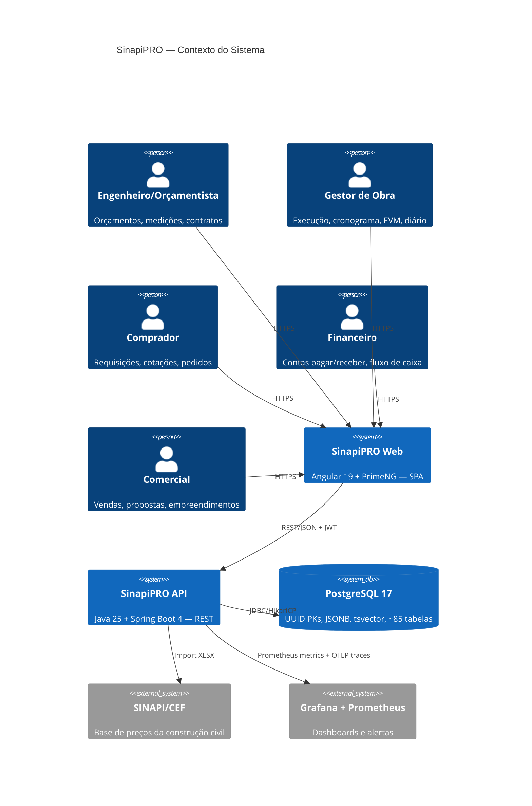

# 🏗️ Arquitetura — SinapiPRO

## Visão Geral (C4 — Context)



## Números do Sistema (estado atual)

| Métrica | Valor |
|---------|-------|
| Módulos de negócio | 34 |
| Controllers REST | 53 |
| Endpoints (GET/POST/PUT/DELETE) | 565 |
| Entidades JPA | ~110 |
| Tabelas PostgreSQL | ~85 |
| Migrations Flyway | V1–V4 |

## Módulos Implementados

### Core (Orçamento + Execução)

| Módulo | Controllers | Endpoints | Descrição |
|--------|:-----------:|:---------:|-----------|
| `budget` | 4 | 51 | Orçamentos, BDI, memória de cálculo, propostas, encargos sociais |
| `measurement` | 1 | 19 | Medições com workflow DRAFT→SUBMITTED→APPROVED→PAID |
| `contract` | 1 | 8 | Contratos com aditivos (change orders) e retenção |
| `schedule` | 1 | 18 | Cronograma CPM, baselines, feriados, dependências |
| `dailylog` | 1 | 13 | Diário de obra (tarefas, MO, equipamentos, materiais, fotos) |
| `jobcosting` | 1 | 8 | Centros de custo + transações (orçado × comprometido × realizado) |

### Suprimentos + Estoque

| Módulo | Controllers | Endpoints | Descrição |
|--------|:-----------:|:---------:|-----------|
| `procurement` | 4 | 31 | Requisição→Cotação→Pedido→Recebimento, portal fornecedor |
| `supplier` | 2 | 17 | Fornecedores, documentos, contas bancárias, avaliações |
| `inventory` | 1 | 9 | Estoque: itens, movimentações, requisições |
| `invoice` | 1 | 5 | Notas fiscais de entrada |

### Financeiro

| Módulo | Controllers | Endpoints | Descrição |
|--------|:-----------:|:---------:|-----------|
| `finance` | 5 | 35 | Contas pagar/receber, parcelas, banco, cheques, retenções, adiantamentos |

### Comercial + Pós-Venda

| Módulo | Controllers | Endpoints | Descrição |
|--------|:-----------:|:---------:|-----------|
| `commercial` | 3 | 36 | Empreendimentos, unidades, vendas, propostas, comissões |
| `aftersales` | 1 | 8 | Tickets de assistência técnica |

### Qualidade + Segurança

| Módulo | Controllers | Endpoints | Descrição |
|--------|:-----------:|:---------:|-----------|
| `safety` | 1 | 8 | Inspeções, incidentes, checklists |
| `rfi` | 1 | 6 | Request for Information |
| `punchlist` | 1 | 6 | Punch list (pendências de entrega) |
| `submittal` | 1 | 7 | Submittals (aprovação de materiais/métodos) |

### Cadastros + Infraestrutura

| Módulo | Controllers | Endpoints | Descrição |
|--------|:-----------:|:---------:|-----------|
| `registry` | 3 | 79 | Clientes, funcionários, EPIs, exames, treinamentos, bancos, categorias |
| `project` | 1 | 8 | Obras (CRUD + workspace) |
| `sinapi` | 2 | 19 | Composições + insumos SINAPI (importação XLSX) |
| `equipment` | 1 | 9 | Equipamentos, uso, abastecimento |
| `team` | 1 | 7 | Equipes e membros |
| `timetracking` | 2 | 16 | Apontamento de horas, banco de horas, tabela de preços MO |
| `delivery` | 1 | 5 | Entrega de obra (checklist) |
| `weather` | 1 | 3 | Atrasos por clima |

### Plataforma

| Módulo | Controllers | Endpoints | Descrição |
|--------|:-----------:|:---------:|-----------|
| `security` | 2 | 10 | Auth (JWT HMAC) + RBAC (roles/permissions) |
| `tenant` | — | — | Multi-tenancy (Hibernate Filter, tenant_id) |
| `notification` | 1 | 4 | Alertas e notificações |
| `analytics` | 2 | 14 | Dashboards e KPIs |
| `report` | 1 | 89 | Relatórios PDF/Excel (orçamento, medição, financeiro, suprimentos, comercial) |
| `shared` | 3 | 10 | SSE events, lixeira, templates de relatório |
| `config` | 1 | 2 | Parâmetros do sistema |

## Padrão por Módulo (Vertical Slicing)

```
{module}/
├── api/            ← @RestController + request/response records
├── application/    ← @Service + @Transactional + business logic
└── domain/         ← @Entity + Repository interface (Spring Data)
```

**Regras:**
- `api/` — sem lógica de negócio, apenas validação de entrada e mapeamento
- `application/` — orquestra domínio, eventos, métricas. Ponto de transação
- `domain/` — entities JPA + repository. Sem dependência de outros módulos
- `shared/` — cross-cutting: base entity, error handler, events, observability

## Features Java 25 na Arquitetura

| Feature | Uso |
|---------|-----|
| Virtual Threads | Todas as requests HTTP (zero thread pinning) |
| Structured Concurrency | Operações paralelas em services |
| Sealed Classes | Hierarquia de exceções, domain events |
| Gatherers | Agregações em stream (Curva ABC, EVM) |
| Pattern Matching | Exception handler, validações de status |
| Records | DTOs, value objects, resultados de cálculo |

## Decisões Arquiteturais

| Decisão | Justificativa |
|---------|---------------|
| Monolito modular | Complexidade de domínio, não de escala. Vertical slicing isola módulos |
| UUID como PK | Distributed-friendly, sem exposição de sequência |
| Multi-tenant (Hibernate Filter) | Isolamento por empresa via `tenant_id` + filtro automático |
| RBAC (Role + permissions) | Controle granular por módulo/ação |
| JSONB para metadata | Flexibilidade sem migrations para campos opcionais |
| tsvector full-text | Busca em composições SINAPI sem Elasticsearch |
| Stateless (JWT HMAC) | Escalabilidade horizontal sem session affinity |
| SSE (não WebSocket) | Unidirecional server→client, compatível com HTTP/2 |
| ProblemDetail (RFC 9457) | Padrão de erro interoperável |

## Módulos Planejados (ainda não implementados)

| Módulo | Descrição | Referência |
|--------|-----------|------------|
| BIM Integration | Visualização 3D + vinculação com orçamento | PRD §3.2 |
| Portal Cliente | Acesso externo para acompanhamento de obra | PRD §3.2 |
| Portal Fornecedor (avançado) | Cotação online + documentos | Parcialmente em `procurement` |
| App Mobile | PWA para diário de obra em campo | PRD §3.2 |
| Workflow Engine | Automação de aprovações configurável | BUSINESS-FLOWS.md |
| NFS-e / CNAB | Integração fiscal brasileira | PRD §1.3 |
