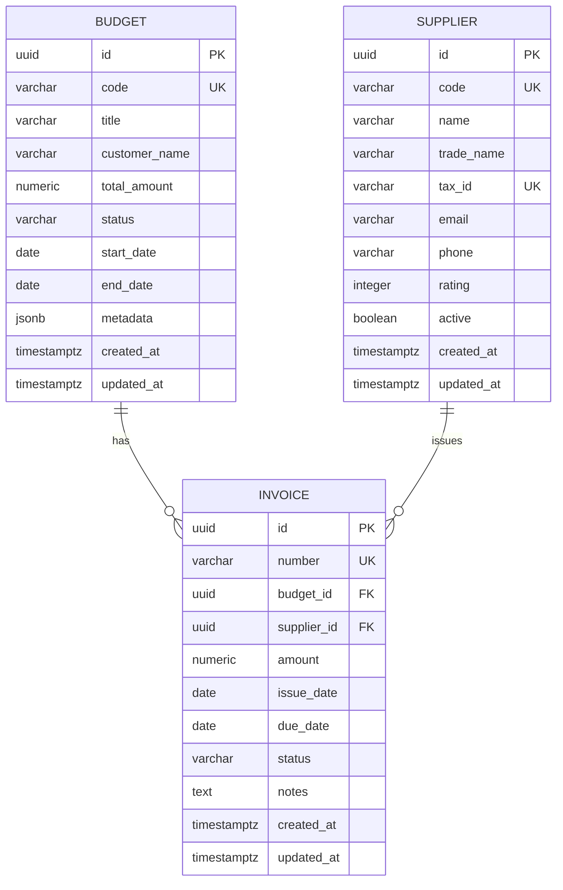
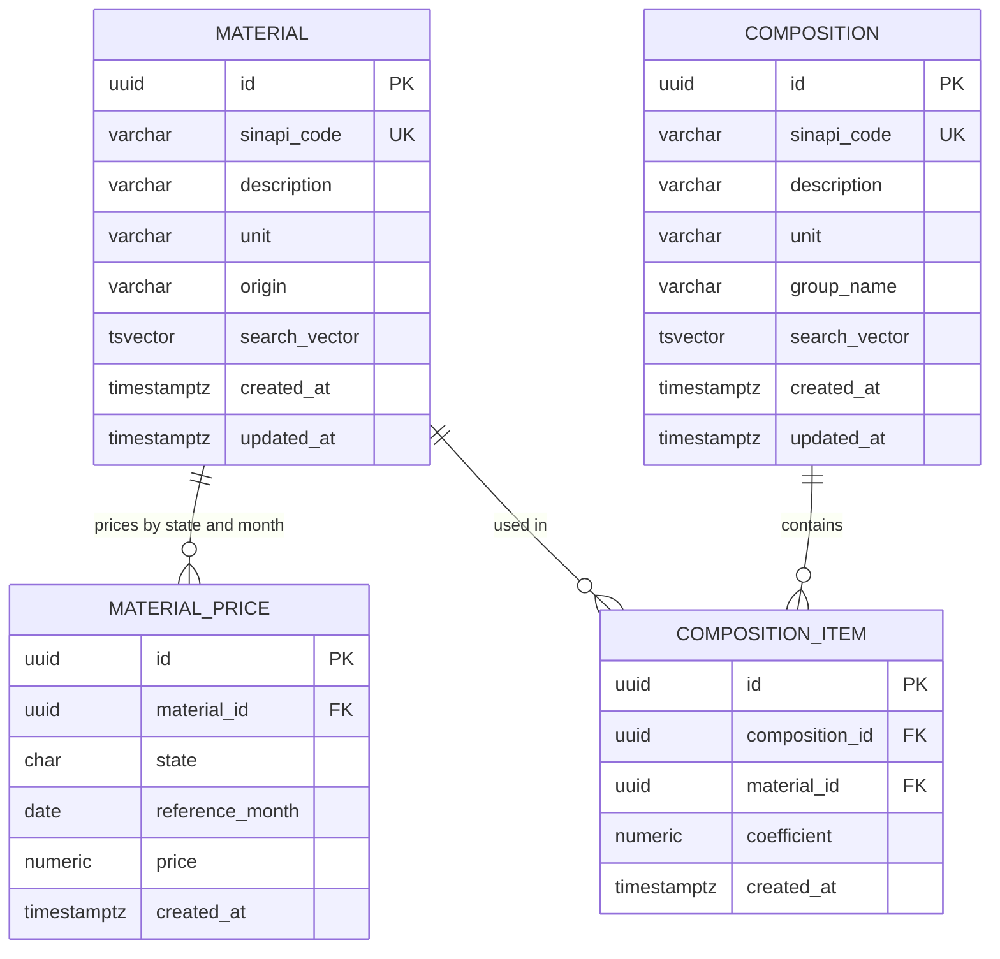
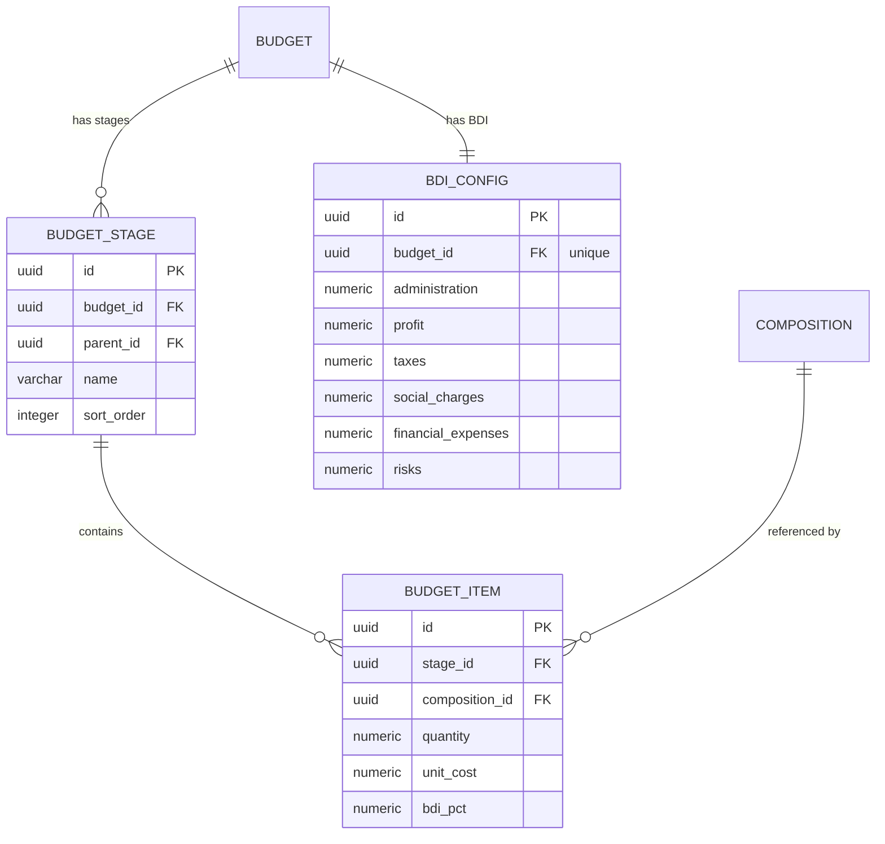
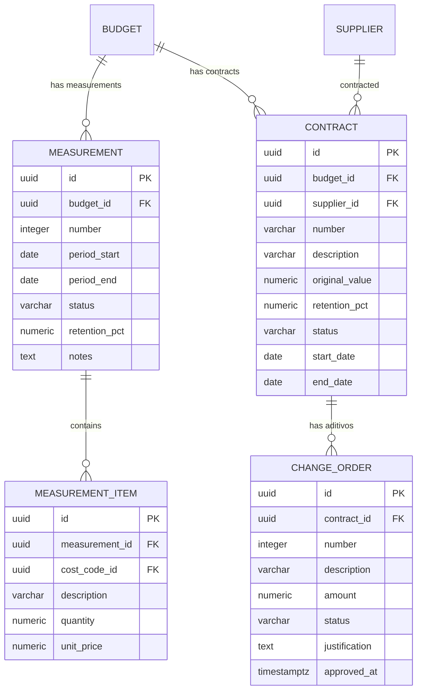
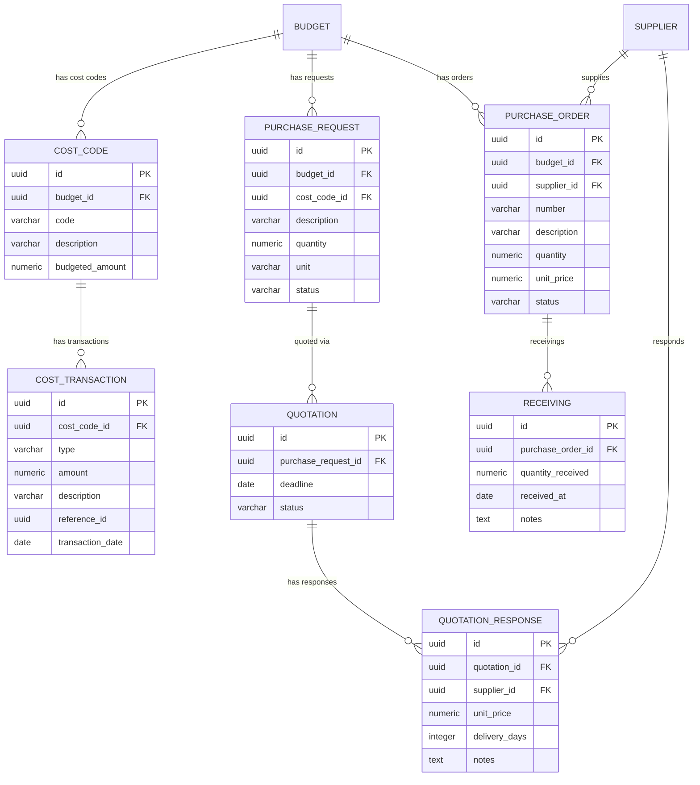

# 🗄️ Modelo de Dados — PostgreSQL 17

## Diagrama ER — Core

## Diagrama ER — SINAPI (Composições e Insumos)

## Diagrama ER — Orçamento Detalhado

## Diagrama ER — Medições e Contratos

## Diagrama ER — Job Costing e Suprimentos

## Detalhes dos Tipos (PostgreSQL)

| Coluna | Tipo Real | Notas |
|--------|-----------|-------|
| `id` | `uuid` | PK, gerado via `gen_random_uuid()` |
| `code`, `number` | `varchar(40)` | Chave de negócio, UNIQUE |
| `name`, `title`, `description` | `varchar(140-500)` | Texto descritivo |
| `total_amount`, `amount`, `original_value` | `numeric(18,2)` | Valores monetários |
| `quantity`, `unit_cost`, `unit_price` | `numeric(14,4)` | Quantidades e preços unitários |
| `coefficient` | `numeric(14,6)` | Coeficientes SINAPI (alta precisão) |
| `bdi_pct`, `retention_pct` | `numeric(6,4)` | Percentuais |
| `metadata` | `jsonb` | Campos flexíveis sem migration |
| `search_vector` | `tsvector` | Full-text search (GIN index) |
| `state` | `char(2)` | UF brasileira |
| `status` | `varchar(20-30)` | Enum como string |
| `created_at`, `updated_at` | `timestamptz` | Auditoria |

## Features PostgreSQL Utilizadas

| Feature | Uso |
|---------|-----|
| `uuid` PK | Distributed-friendly, sem exposição de sequência |
| `jsonb` | Metadata flexível em budget (campos opcionais sem migration) |
| `tsvector` + GIN | Full-text search em composições e materiais SINAPI |
| `numeric(18,2)` | Valores monetários com precisão exata |
| Índices parciais | `idx_supplier_active`, `idx_invoice_status` |
| Índices compostos | `(material_id, state, reference_month)` para lookup de preço |
| `UNIQUE` constraints | Chaves de negócio (code, sinapi_code, number) |
| `ON DELETE CASCADE` | Limpeza automática de filhos ao remover pai |
| `gen_random_uuid()` | Geração de UUID no banco (pgcrypto) |
| Views | `showcase_portfolio_summary` para dashboards |

## Migrations (Flyway)

| Migration | Descrição |
|-----------|-----------|
| V1 | Schema core: budget, supplier, invoice + índices + view |
| V2 | Dados de demonstração (seed) |
| V3 | Composições SINAPI: material, material_price, composition, composition_item |
| V4 | Dados SINAPI (insumos, preços, composições reais) |
| V5 | Orçamento detalhado: budget_stage, budget_item, bdi_config |
| V6 | Job Costing: cost_code, cost_transaction |
| V7 | Cronograma: schedule_activity, activity_dependency |
| V8 | Medições: measurement, measurement_item |
| V9 | Contratos: contract, contract_item, change_order |
| V10 | Suprimentos: purchase_request, quotation, purchase_order, receiving |
| V11 | Diário de Obra: daily_log + sub-tabelas |
| V12 | Equipamentos: equipment, equipment_usage |
| V13 | Documentos, RFI, Punch List, Segurança do Trabalho |
| V14 | Submittals, Weather Delays, Timesheet, Notificações |
