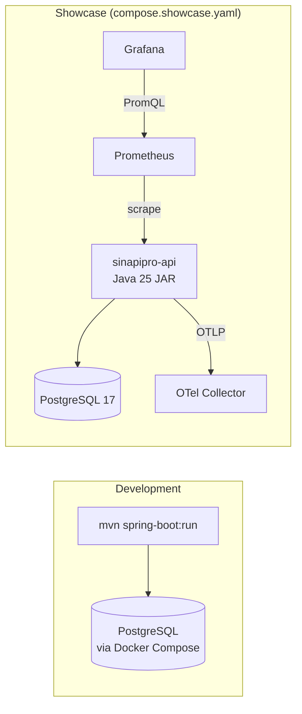

# 🚀 Deploy e Observabilidade

## Ambientes



## Development (Local)

```bash
# Terminal 1 — Backend (API + PostgreSQL)
cd api
mvn spring-boot:run -s .mvn/settings.xml
# http://localhost:8080 (Swagger: /swagger-ui.html)

# Terminal 2 — Frontend (Angular)
cd web
nvm use 22
npx ng serve
# http://localhost:4200 (proxy /api/v1 → :8080)
# Login: admin@sinapipro.dev / SinapiPro#2026
```

O Spring Boot Docker Compose inicia o PostgreSQL automaticamente (`compose.yaml`):

```yaml
services:
  postgres:
    image: postgres:17
    environment:
      POSTGRES_DB: sinapipro
      POSTGRES_USER: sinapipro
      POSTGRES_PASSWORD: sinapipro
    ports:
      - "5432:5432"
```

## Showcase (Full Stack)

```bash
docker compose -f compose.showcase.yaml up -d
```

Inclui:
- **App** — JAR executável (Java 25, Virtual Threads)
- **PostgreSQL 17** — banco de dados
- **Prometheus** — coleta de métricas
- **Grafana** — dashboards (porta 3000)
- **OpenTelemetry Collector** — pipeline de traces

## Docker Build

```dockerfile
FROM eclipse-temurin:25-jre-alpine
WORKDIR /app
COPY target/sinapipro-api-*.jar app.jar
EXPOSE 8080
ENTRYPOINT ["java", "--enable-preview", "-jar", "app.jar"]
```

Build:
```bash
cd api
mvn package -s .mvn/settings.xml -DskipTests
docker build -t sinapipro/api:latest .
```

## GraalVM Native Image

```bash
cd api
mvn package -Pnative -s .mvn/settings.xml
# Gera binário nativo em target/sinapipro-api
```

Startup: ~50ms (vs ~2s com JVM).

---

## Observabilidade

### Endpoints

| Endpoint | Descrição |
|----------|-----------|
| `/actuator/health` | Health check (público) |
| `/actuator/health/liveness` | Kubernetes liveness probe |
| `/actuator/health/readiness` | Kubernetes readiness probe |
| `/actuator/prometheus` | Métricas Prometheus (ROLE_ADMIN) |
| `/actuator/info` | Informações da aplicação (público) |
| `/api/v1/events` | SSE stream de eventos (autenticado) |

### Métricas Customizadas

```
# Operações de negócio
sinapipro_business_operations_total{domain="budget", type="created"}
sinapipro_business_operations_total{domain="measurement", type="approved"}

# Observações (latência por operação)
budget.findAll (timer)
budget.create (timer)
measurement.approve (timer)
```

### Tracing (OpenTelemetry)

```yaml
# application.yaml
management:
  tracing:
    sampling:
      probability: 1.0  # 100% em dev, ajustar em prod
  otlp:
    tracing:
      endpoint: http://otel-collector:4318/v1/traces
```

Cada request gera um trace com spans para:
- Controller → Service → Repository
- Queries SQL (via Hibernate instrumentation)
- Chamadas HTTP externas

### Logs

Formato JSON estruturado em produção:
```json
{
  "timestamp": "2025-03-15T10:30:00Z",
  "level": "INFO",
  "traceId": "abc123",
  "spanId": "def456",
  "logger": "com.sinapipro.api.budget.application.BudgetService",
  "message": "Budget created",
  "budgetId": "uuid",
  "code": "ORC-001"
}
```

---

## Configuração

### application.yaml (principais)

```yaml
spring:
  threads:
    virtual:
      enabled: true          # Virtual Threads para todas as requests

  datasource:
    url: jdbc:postgresql://localhost:5432/sinapipro
    username: sinapipro
    password: sinapipro
    hikari:
      maximum-pool-size: 20  # Virtual Threads: pool menor é OK

  jpa:
    open-in-view: false      # Performance: sem lazy loading em controllers
    hibernate:
      ddl-auto: validate     # Flyway gerencia schema

  flyway:
    enabled: true
    locations: classpath:db/migration

server:
  shutdown: graceful         # Drain connections antes de parar

management:
  endpoints:
    web:
      exposure:
        include: health,info,prometheus
  metrics:
    tags:
      application: sinapipro-api
```

### Variáveis de Ambiente (Produção)

| Variável | Descrição | Default |
|----------|-----------|---------|
| `SPRING_DATASOURCE_URL` | JDBC URL do PostgreSQL | `jdbc:postgresql://localhost:5432/sinapipro` |
| `SPRING_DATASOURCE_USERNAME` | Usuário do banco | `sinapipro` |
| `SPRING_DATASOURCE_PASSWORD` | Senha do banco | `sinapipro` |
| `SINAPIPRO_SECURITY_SECRET` | Chave HMAC para JWT | (obrigatório) |
| `MANAGEMENT_OTLP_TRACING_ENDPOINT` | Endpoint OTLP | `http://localhost:4318/v1/traces` |

---

## Health Checks

```bash
# Liveness (app está rodando?)
curl http://localhost:8080/actuator/health/liveness
# {"status":"UP"}

# Readiness (app está pronta para receber tráfego?)
curl http://localhost:8080/actuator/health/readiness
# {"status":"UP","components":{"db":{"status":"UP"},"diskSpace":{"status":"UP"}}}
```

## CI/CD

Pipeline (`.github/workflows/showcase-ci.yml`):


