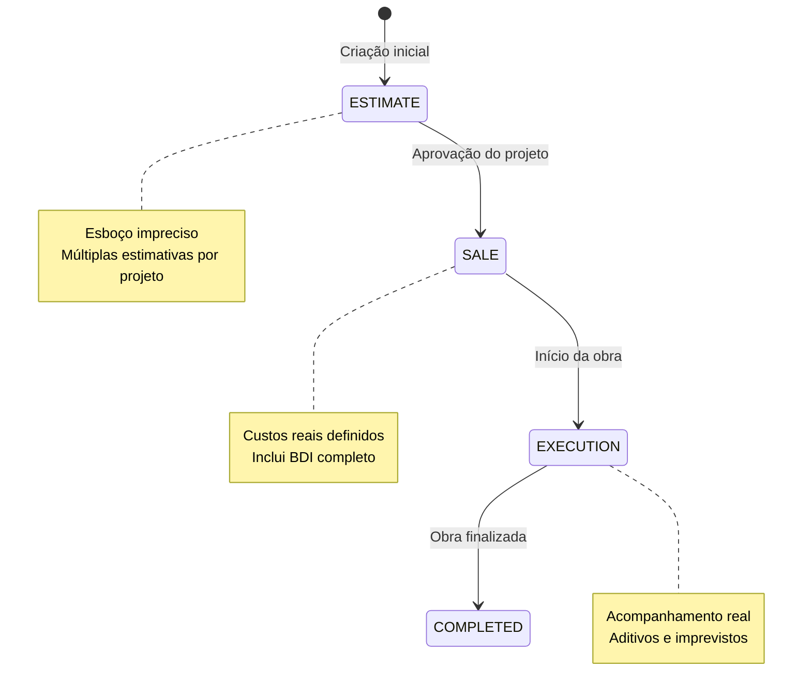
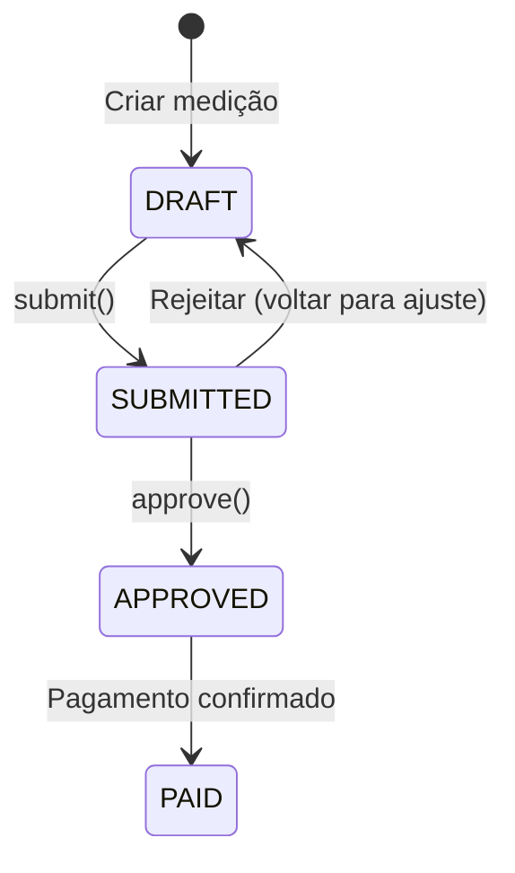
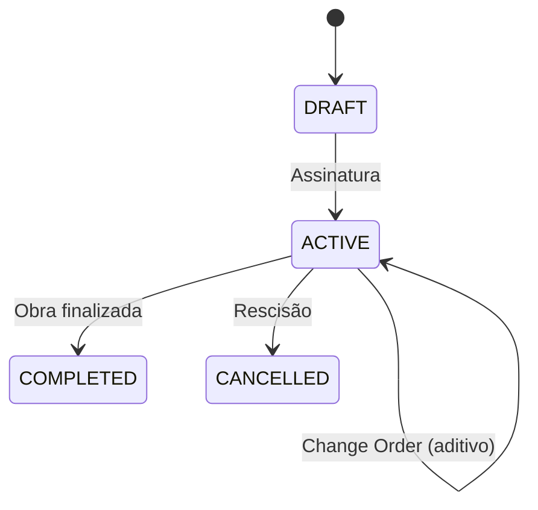
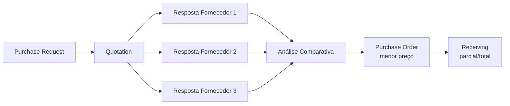

# 📐 Domínio — Regras de Negócio

## Conceitos Fundamentais

### Obra
Conjunto de atividades que alteram a aparência, estrutura ou forma de uma edificação. No SinapiPRO, uma obra é representada por um **Budget** (orçamento) que agrupa todas as informações de custo, cronograma e execução.

### SINAPI
Sistema Nacional de Pesquisa de Custos e Índices da Construção Civil, mantido pela Caixa Econômica Federal. Fornece:
- **Insumos** (materiais, mão de obra, equipamentos) com preços por estado/mês
- **Composições** (serviços) que combinam insumos com coeficientes

---

## Orçamento (Budget)

### Tipos de Orçamento



| Tipo | Descrição |
|------|-----------|
| **Estimativa** | Orçamento preliminar, impreciso. Pode haver vários por projeto |
| **Venda** | Orçamento com custos reais, BDI, impostos. Usado para concorrência |
| **Execução** | Originado da venda. Recebe o realizado e aditivos |

### Estrutura do Orçamento

```
Orçamento
├── Etapa 1 (budget_stage)
│   ├── Sub-etapa 1.1
│   │   ├── Item (composição SINAPI + quantidade + BDI)
│   │   └── Item
│   └── Sub-etapa 1.2
│       └── Item
├── Etapa 2
│   └── Item
└── BDI Config (administração, lucro, impostos, encargos)
```

Até 4 níveis de hierarquia de etapas.

### BDI (Benefícios e Despesas Indiretas)

| Componente | Descrição |
|-----------|-----------|
| Administração | Custos administrativos da empresa |
| Lucro | Margem de lucro desejada |
| Impostos | ISS, PIS, COFINS, etc |
| Encargos Sociais | INSS, FGTS, férias, 13º |
| Despesas Financeiras | Custo do capital |
| Riscos | Contingência para imprevistos |

**Preço de venda** = Custo direto × (1 + BDI%)

### Curva ABC

Orçamento ordenado por impacto no custo total (decrescente). Classifica itens em:
- **A** — 20% dos itens que representam ~80% do custo
- **B** — 30% dos itens que representam ~15% do custo
- **C** — 50% dos itens que representam ~5% do custo

---

## Composições SINAPI

### Cálculo de Custo Unitário

```
Custo da Composição = Σ (coeficiente_i × preço_insumo_i)
```

Onde:
- `coeficiente` = quantidade do insumo necessária para 1 unidade do serviço
- `preço_insumo` = preço do material no estado/mês de referência

### Tipos de Insumo

| Tipo | Unidade | Exemplo |
|------|---------|---------|
| Material | kg, m³, m², un | Cimento, areia, tijolo |
| Mão de Obra | H/H (hora-homem) | Pedreiro, servente, encanador |
| Equipamento | h, mês | Betoneira, retroescavadeira |

---

## Medições

### Workflow



### Regras
- Cada medição tem um `number` sequencial por orçamento
- `retention_pct` — percentual retido (garantia contratual)
- **Valor bruto** = Σ(quantity × unit_price) dos itens
- **Valor líquido** = Valor bruto × (1 - retention_pct)
- Ao aprovar: gera `CostTransaction(ACTUAL)` + `Invoice` automaticamente (Progress Billing)

### Acumulado e Saldo
- **Acumulado** = soma de todas as medições aprovadas/pagas
- **Saldo** = valor contratado - acumulado
- **% Medido** = (acumulado / valor contratado) × 100

---

## Contratos

### Lifecycle



### Change Orders (Aditivos)
- Alteram o valor original do contrato
- Workflow próprio: PENDING → APPROVED/REJECTED
- **Valor atualizado** = original_value + Σ(change_orders aprovados)

---

## Suprimentos

### Fluxo Completo



### Regras
- Cotação compara preço unitário e prazo de entrega
- Pedido gerado automaticamente pelo menor preço
- Recebimento pode ser parcial (status: PARTIAL) ou total (status: RECEIVED)
- Ao gerar pedido: registra `CostTransaction(COMMITTED)`
- Ao receber totalmente: registra `CostTransaction(ACTUAL)`

---

## Job Costing (EVM)

### Cost Codes
Cada orçamento tem cost codes que agrupam custos por categoria:
- Cada cost code tem um `budgeted_amount` (orçado)
- Transações registram: BUDGETED, COMMITTED, ACTUAL

### Earned Value Management

| Métrica | Fórmula | Significado |
|---------|---------|-------------|
| **PV** (Planned Value) | Σ budgeted | Valor planejado até a data |
| **EV** (Earned Value) | Σ committed (concluídos) | Valor agregado (trabalho realizado) |
| **AC** (Actual Cost) | Σ actual | Custo real incorrido |
| **CPI** | EV / AC | Índice de performance de custo |
| **SPI** | EV / PV | Índice de performance de prazo |
| **EAC** | AC + (BAC - EV) / CPI | Estimativa no término |
| **VAC** | BAC - EAC | Variação no término |

- **CPI > 1** → abaixo do orçamento (bom)
- **SPI > 1** → adiantado no cronograma (bom)

---

## Cronograma

### Caminho Crítico (CPM)
- Atividades com dependências (FS: Finish-to-Start)
- Forward pass: calcula Early Start / Early Finish
- Backward pass: calcula Late Start / Late Finish
- **Folga** = Late Start - Early Start
- **Caminho Crítico** = atividades com folga = 0

### Curva S
Comparativo acumulado: planejado vs. realizado ao longo do tempo.

---

## Glossário

| Termo | Definição |
|-------|-----------|
| **SINAPI** | Sistema Nacional de Pesquisa de Custos e Índices da Construção Civil |
| **BDI** | Benefícios e Despesas Indiretas |
| **Composição** | Serviço composto por insumos com coeficientes |
| **Insumo** | Material, mão de obra ou equipamento |
| **Coeficiente** | Quantidade do insumo para 1 unidade do serviço |
| **Medição** | Apuração periódica do trabalho executado |
| **Aditivo** | Alteração contratual (change order) |
| **Curva ABC** | Classificação de itens por impacto no custo |
| **EVM** | Earned Value Management — gestão de valor agregado |
| **CPM** | Critical Path Method — método do caminho crítico |
| **Progress Billing** | Faturamento por medição aprovada |
| **Retenção** | Percentual retido como garantia contratual |
